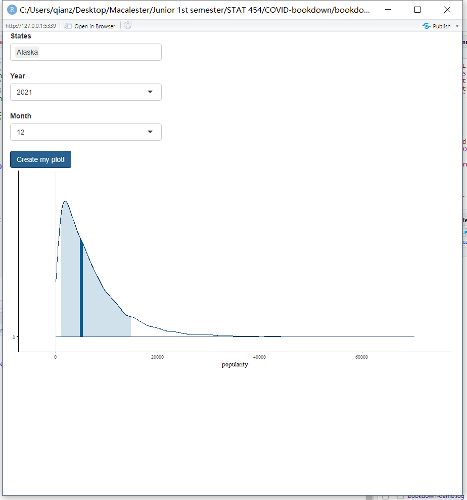

# Shiny App

This is baby shiny app which only works when you pick 2021 as year and 12 as month. We use this shiny app to visualize our prediction to December 2021 using MCMC simulation. Later on, after we complete our prediction, we will polish on the ascetics and contents of this shiny app. Also, we might also add some visualizations for the raw data in this shiny app.

```{r, eval = FALSE}

library(shiny)

covid19 <- read_csv(url("https://raw.githubusercontent.com/nytimes/covid-19-data/master/us-states.csv"))

ui <- fluidPage(
  selectInput("states", 
              "States", 
              choices = list("Washington", "Illinois", "California", "Arizona", "Massachusetts", "Wisconsin",                                        "Texas", "Nebraska", "Utah", "Oregon", "Florida", "New York",            
                             "Rhode Island", "Georgia", "New Hampshire", "North Carolina", "New Jersey", "Colorado",    
                             "Maryland", "Nevada", "Tennessee", "Hawaii", "Indiana", "Kentucky",                
                             "Minnesota", "Oklahoma", "Pennsylvania", "South Carolina", "District of Columbia","Kansas",
                             "Missouri", "Vermont", "Virginia", "Connecticut", "Iowa", "Louisiana",               
                             "Ohio", "Michigan", "South Dakota", "Arkansas", "Delaware", "Mississippi",             
                             "New Mexico", "North Dakota", "Wyoming", "Alaska", "Maine", "Alabama",                 
                             "Idaho", "Montana", "Puerto Rico", "Virgin Islands", "Guam", "West Virginia",           
                             "Northern Mariana Islands")),
  selectInput("year",
              "Year",
              choices = list(2020, 2021, 2022)),
  selectInput("month",
              "Month",
              choices = list(1, 2, 3, 4, 5, 6 , 7, 8, 9, 10, 11, 12)),
  submitButton(text = "Create my plot!"),
  plotOutput(outputId = "timeplot")
)

server <- function(input, output) {
  output$timeplot <- renderPlot({
    mcmc_areas(posterior_predict(mod3_posterior, newdata = covid19_test %>% filter(state == input$states) %>% filter(year == input$year) %>% filter(month == input$month)), prob = 0.8) +
    xlab("Number of COVID19 Cases") 
  })
}

shinyApp(ui = ui, server = server)
```

Example (Alaska):


