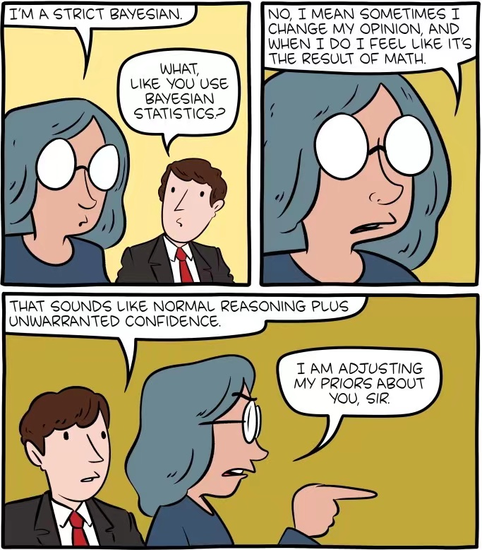

--- 
title: "STAT 454 Bayesian Statistics: Short term COVID-19 prediction model using monthly incidence data"
author: "Raymond Gu, Zefan Qian"
date: "`r Sys.Date()`"
site: bookdown::bookdown_site
output: bookdown::gitbook
documentclass: book
bibliography: [book.bib, packages.bib]
biblio-style: apalike
link-citations: yes
github-repo: rstudio/bookdown-demo
---

# Preface

This is the bookdown of Raymond and Zefan's STAT 455 Bayesian Statistics Project.

Credit to [SMBC](smbc-comics.com).
